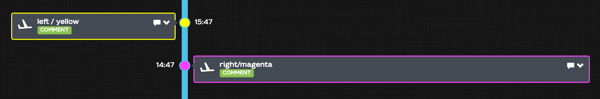

# FW.setStyle\(\)

You can dynamically set the style of your event in the timeline view by setting some styling properties with this function. any name/value pair is accepted. 2 names are predefined for the display in the timeline:

* color: sets the color of the event in the timeline color is in the CSS3 format \([http://www.w3schools.com/cssref/css\_colors\_legal.asp](http://www.w3schools.com/cssref/css_colors_legal.asp)\)
* pos: `'left'` or `'right'`. The event is on the left or the right side of the vertical time bar. Note that the position is set on the left on small devices \(smartphones\)



```javascript
await FW.setStyle('color', 'yellow');
await FW.setStyle('pos', 'left');
```

> those styles can be set manually for the comments thru the timeline

