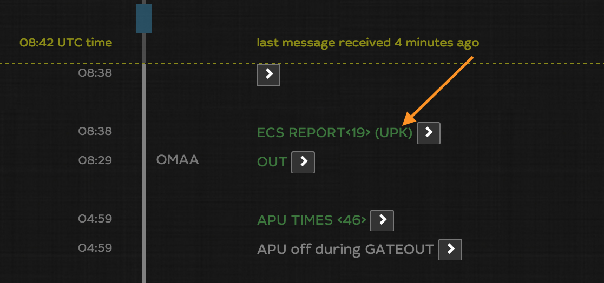

# FW.setTitle

You can override the default title for any event in an IFT. You can compose the title with the context of the event. Here is a sample:


Prefer it to `FW.reportInfo()` function for simple text information


```javascript
if (TRIGGER_CODE==='8100') {
  await FW.setTitle('ECS REPORT<19> (UPK)')
}
```



