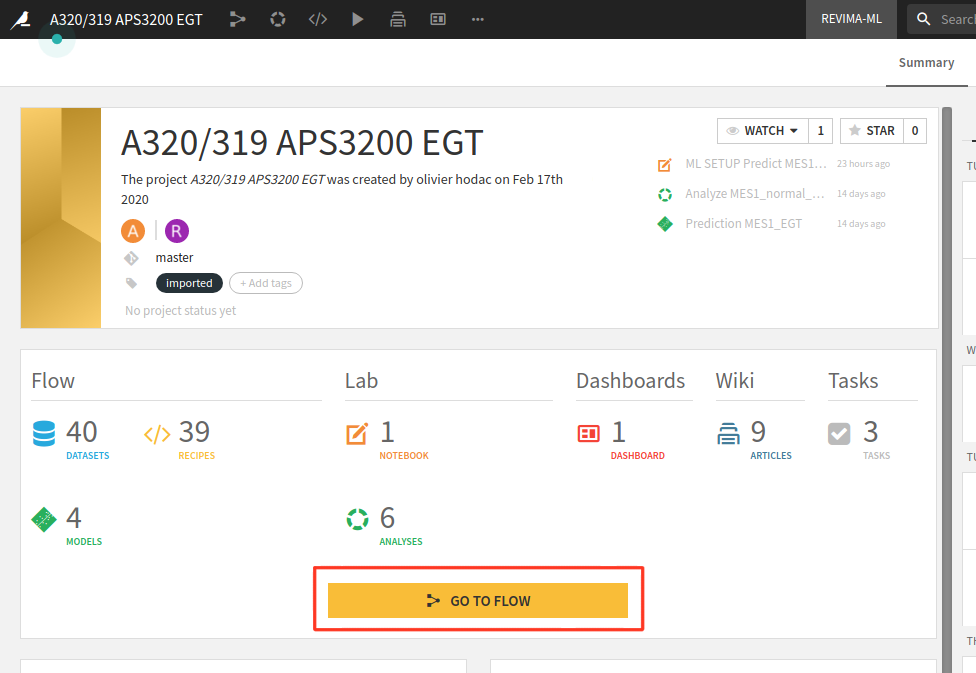
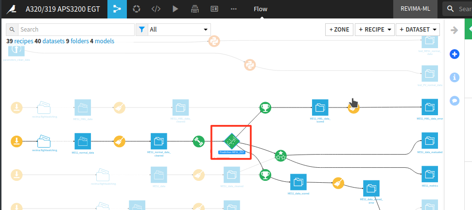
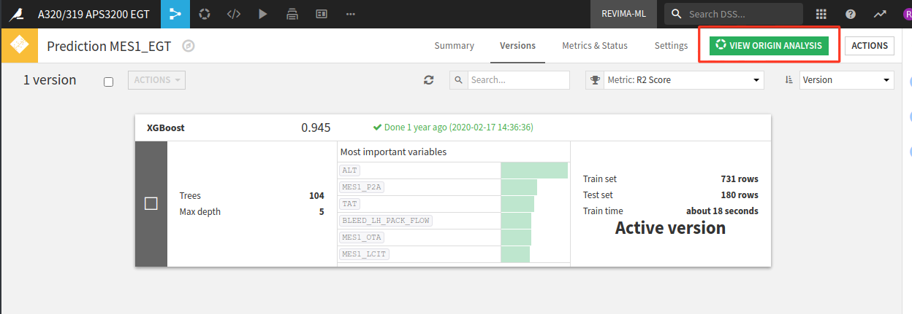
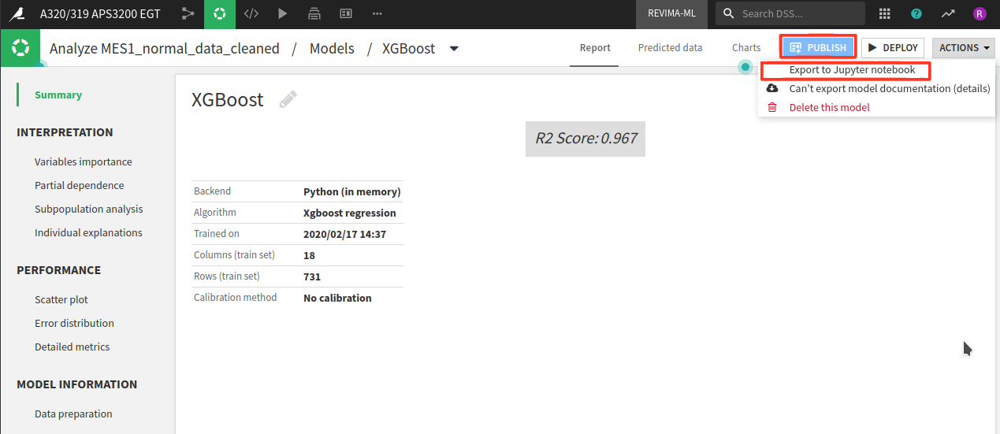
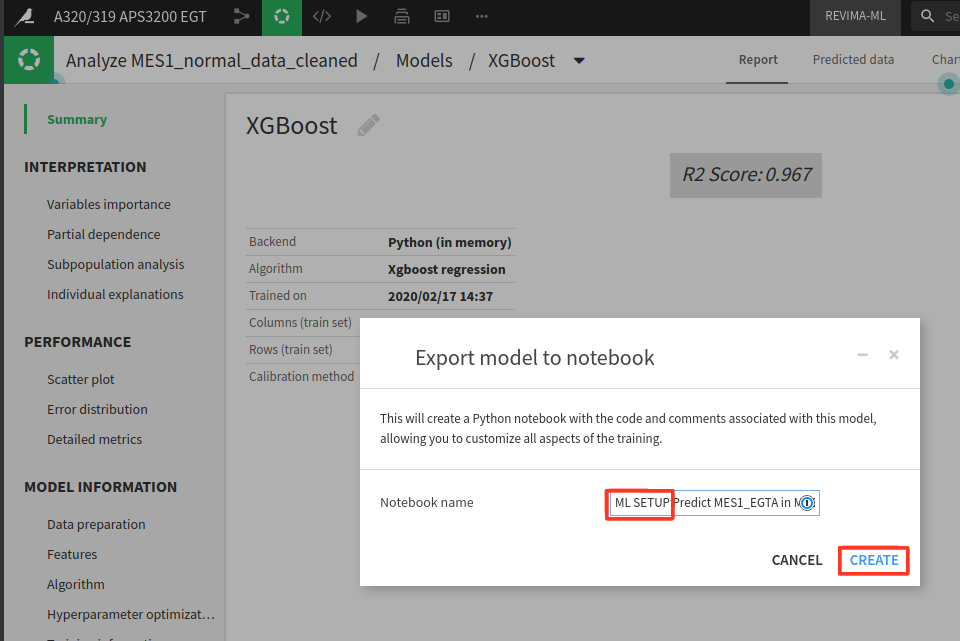
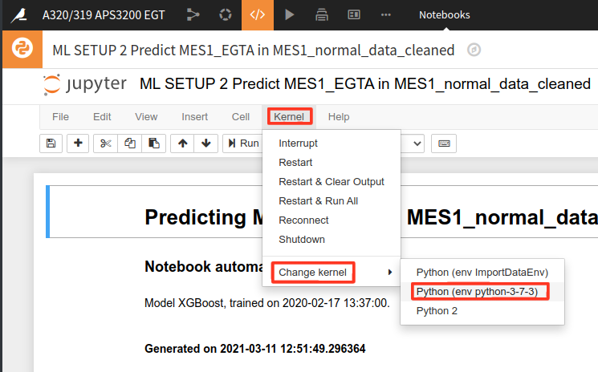
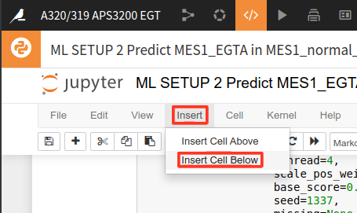
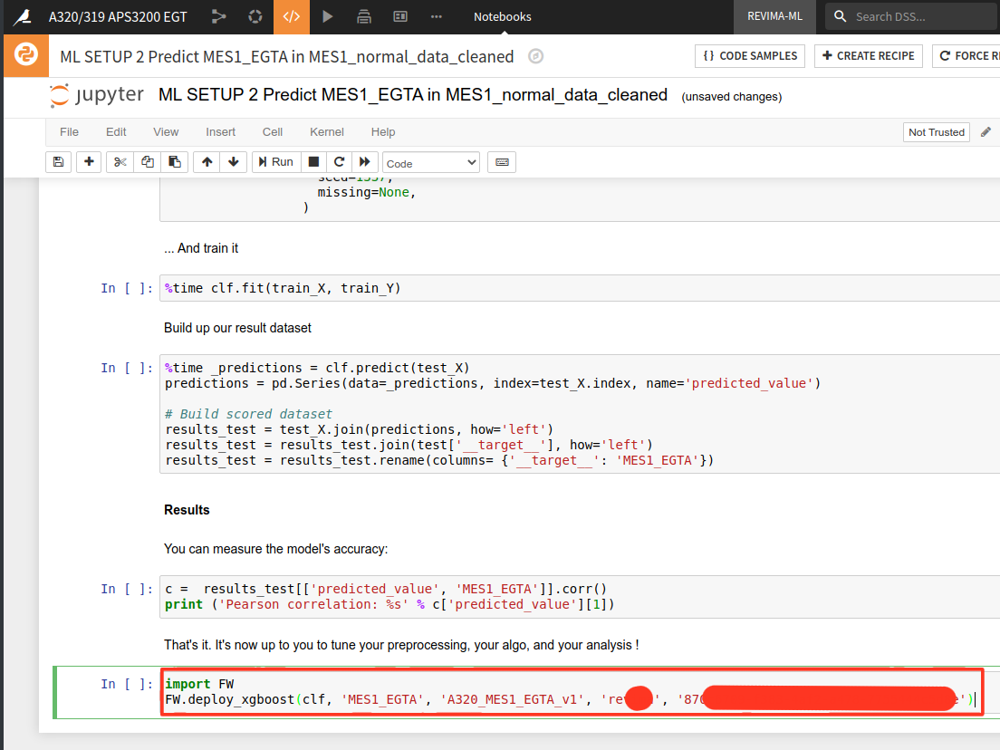
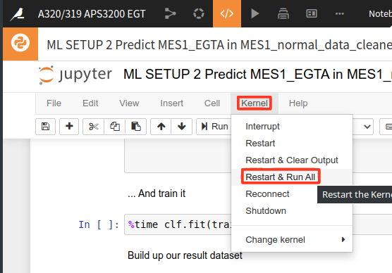
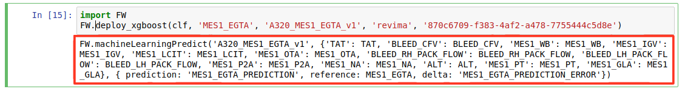

# Step 1: Deployment of an XGBoost model from Dataiku to Wilco

### 

The general idea is to :

* generate a Jypyter notebook
* append instructions at the end of the notebook to deploy the model
* run the notebook.

On the project page, select 'GO TO FLOW'



Double click on the prediction in the flow:



If there is more than one prediction model, select the XGBoost prediction. When on the XGBoost prediction page, select VIEW ORIGIN ANALYSIS :



Then select Publish &gt; Export to Jupyter notebook:



When naming the notebook, please prefix its name by «ML SETUP» for easier support if needed.



On the notebook, select the Python Kerbel 3.7.3 : Kernel &gt; Change kernel &gt; Python \(en python-3-7-3\)



On the notebook, add a cell at the end : Insert &gt; Insert Cell Below



In the newly created cell, add two lines of Python to deploy the model:



```python
import FW
FW.deploy_xgboost(clf, '<PARAM TO PREDICT>', '<PREDICTION NAME>', '<SERVER>', '<API KEY>')
```

* `<PARAM TO PREDICT>`: Name of the parameter that is predicted \(ex: MES1\_EGTA\)
* `<PREDICTION NAME>`: Name of the prediction on the Wilco server. Please use the following pattern \_\_v, ex : A320\_MES1\_EGTA\_v1
* `<SERVER>`: Name of the wilco server to deplot to, without the .flightwatching.com part
* `<API KEY>`: Api key on the wilco server, with ADMIN privileges \(please create a specific Api key for Dataiku, do not reuse an existing one\)

The last step in Dataiku is to execute the whole notebook: Select Kernel &gt; Restart & Run All



When the run is completed, on the last cell, there is a comment that is a template to use in Wilco on an IFT:



### 

