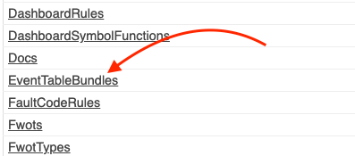

# Tables

A table is a set of configurable columns that represents events fields or sample fields.

Then each row is an event. The events can be filtered and sorted with the URL query, or have a default setting in the configuration. 

You can create as many table as you want, as you can do with dashboards and trends.

The configuration are stored in the general admin


> For the moment, there is no HMI to edit the JSON configuration


