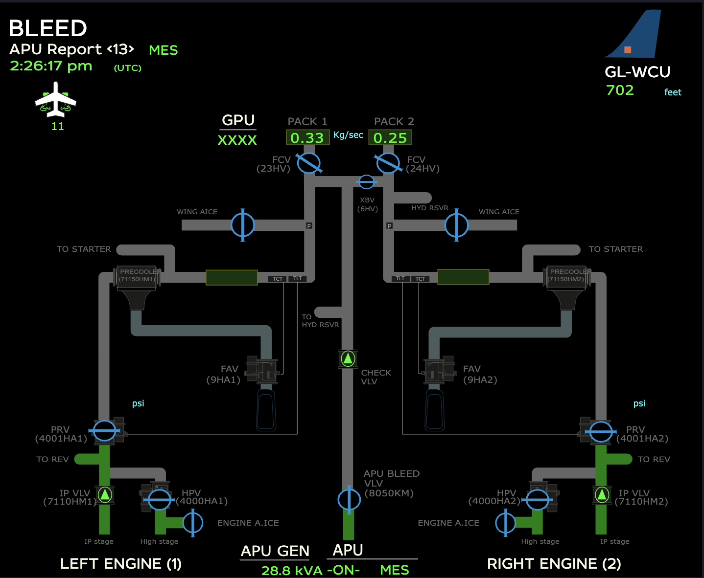

# dashboard

Any report could have customised dashboard, depending on the customer needs. Additionally, reports may be displayed by multiple dashboards, focusing on different aspects of reports' data.

Hereafter, just couple examples of different dashboards:

<figure><figcaption></figcaption></figure>

 

<figure><figcaption></figcaption></figure>

 

<figure><figcaption></figcaption></figure>

 

<figure><figcaption></figcaption></figure>

Most of the elements of dashboards are clickable and let's you visualize the parameters by plotting the graph or getting you to customisable trends. Check that out at [parameters](parameters/) section.&#x20;
