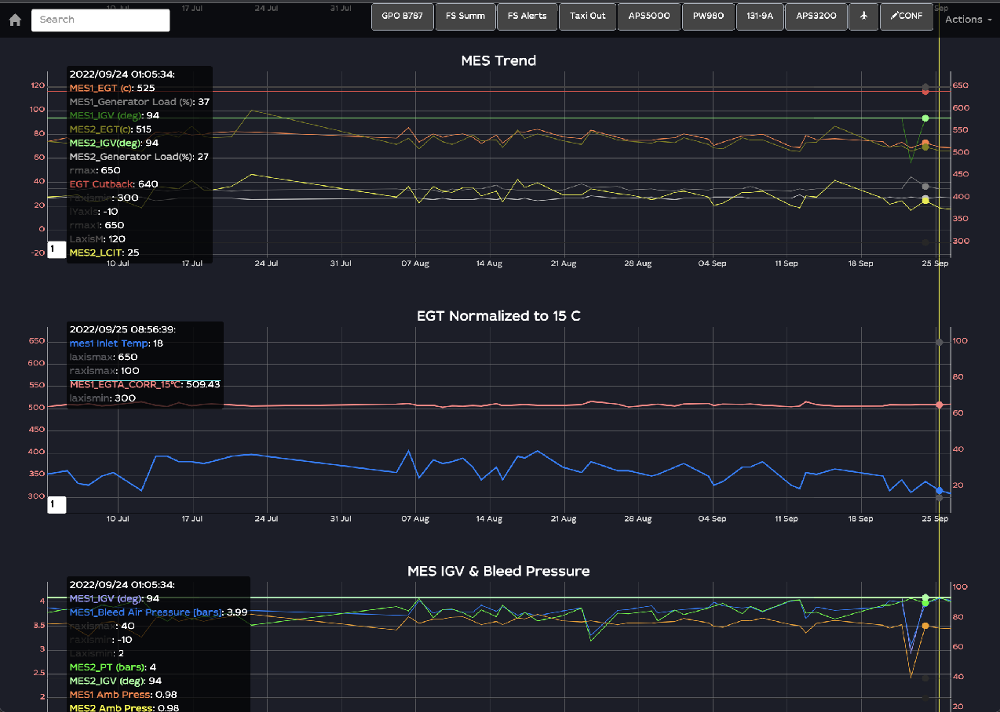
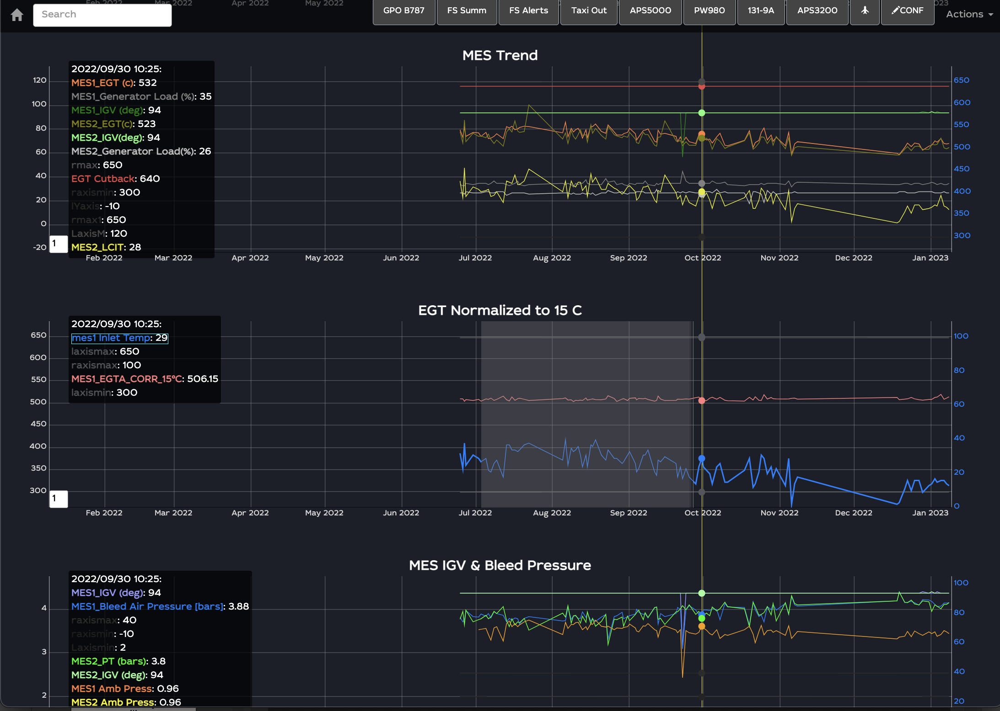

# trend chart

Some _specific zones_ on your dashboard may be  selection-able to get to the _trend chart_. Those zones/buttons are defined at the moment of dashboard design and designed by ADMIN/DESIGNER:

<figure><figcaption>
button to trend chart
</figcaption></figure>

Clicking on that button will take you to pre-defined (yet customisable!) trend chart:

<figure><figcaption>
trend chart
</figcaption></figure>

#### overview of trend chart

The trend chart may contain multiple blocks of graphs (here: MES trend, EGT Normalized to 15C, etc).&#x20;

The trend chart is a graph where the horizontal axis is time and the vertical - the parameters. The timestamp is pre-defined, but could be edited on the URL.

Each block has parameters values represented by lines on the graph and the parameter names with its values beside on the left side of each graph. The vertical yellow line follows your mouse move and shows the value of the parameters on all the graphs. Closest dot of the mouse pointer highlights the line. The corresponding value is shown in a small outlined box.

Click on any dot to get to the information regarding report:

<figure><figcaption>
dot=report
</figcaption></figure>

From here, you can use the buttons situated on the right side of the 'dot-report' box:

* _Go to event_ - click to display the event where the parameter value was recorded
* _Go to timeline_ - click to go to the timeline at the timestamp of the dot-report.&#x20;

#### select zone

You can select a range on the chart time axis, by click and drag (see highlighted in grey in the image below):

<figure><figcaption>
select zone
</figcaption></figure>

You get a closeup focus on that selected interval. Double click on the chart to return to reset the range.

<figure><figcaption>
selected interval
</figcaption></figure>

