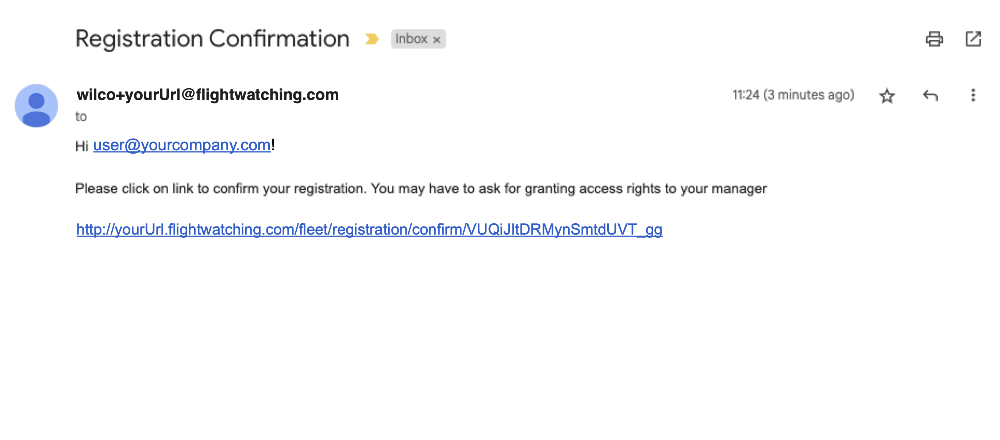

# create an account

From Welcome Page:

<figure><figcaption>
welcome page
</figcaption></figure>

Click on <mark style="background-color:red;">Create an account</mark> button. It will get you to the new page:

<figure><figcaption>
register to wilco
</figcaption></figure>

Please, fill in all the fields:&#x20;

* _e-mail:_ your email address (please, use your company email address)&#x20;


_NOTE: our platform is case sensitive! Remember how you wrote your email address, since it is going to be your user._


* _your new password:_ create your password&#x20;
* _the same:_ repeat your password
* _I'm not a robot:_ please, check the box.&#x20;


_NOTE: to confirm you’re not a robot we use reCAPTCHA._


* _I accept the terms and conditions:_ by checking the box you accept our T\&Cs.&#x20;
* _Register:_ click on that button to finalise registration process.&#x20;

Right after clicking the _Register_ button, you will be re-directed to the next page:&#x20;

<figure><figcaption></figcaption></figure>

Please, check your email inbox, where you should receive _Registration Confirmation_ from the platform. (_Note: this is an automatic email_.) :&#x20;

<figure><figcaption></figcaption></figure>

Please, click on link in your email to **confirm** your registration. The link takes you to the final step of the process:

<figure><figcaption></figcaption></figure>

Your administrator will now grant you right to access to the platform. If you have any issue during that process, please, contact [support](http://localhost:5000/u/korrTCM5SdaFJ29m0LZWw07xLi82).&#x20;

Once your access is granted,  you will be able to [login](login/) to your platform.

\
