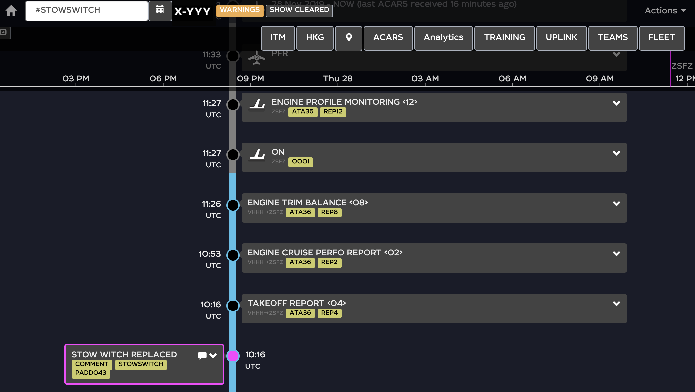

# custom message

Click on any circle on the timeline (on the left side of any message):

<figure><figcaption></figcaption></figure>

That will take you to the _Add a comment_ wizard:

<figure><figcaption>
add a comment
</figcaption></figure>

In the _Add a comment_, fill in all the fields:


_NOTE: The use of_ [_tags_](tags.md) _is possible, but must be limited to_ description. _It **cannot** be in the_ title _of custom message._


* _title -_ limited to 80 characters&#x20;
* _description -_ feel free to add whatever needed here_._
* [_change date and colour_](custom-message.md#edit-custom-message) if you wish&#x20;
* _submit_ to create a message on timeline; or _cancel._

<figure><figcaption>
add a comment
</figcaption></figure>

 

<figure><figcaption>
custom message on timeline
</figcaption></figure>

#### Search custom message

In order to find newly created custom message, we have auto-generated [tag](tags.md) to every comment you create; just tap _#COMMENT_ in the search box. &#x20;

You can also find custom message by taping your customised tags in the search box.

Check the [tags](tags.md) on how to do it.&#x20;

#### Edit custom message

There is variety of possibilities to make _custom message_ even more custom, by editing it.

Open custom message/comment by clicking on the arrow on the right side of the box to show up those options:&#x20;

<figure><figcaption>
edit custom message
</figcaption></figure>

* _changing position_ on the timeline

To change the position of the custom message on the timeline, use the arrows situated on the both sides of the title of _Add a comment_. The default position of the custom messages is on the left colon of the timeline, but you can shift it to the right by clicking on the right arrow.

* _changing colour_ of the message

To change and apply specific colour, click on the black box (default colour) situated at the bottom of the _Add a comment_ wizard, above the CANCEL/SUBMIT buttons.&#x20;

<figure><figcaption>
change color
</figcaption></figure>

When submitted again, the border colour of the message will change:

<figure><figcaption></figcaption></figure>

* _update description_: you can add information, tags or remove any of that at any time
* _edit time_: you can update the time at any time.&#x20;
* _clear/delete_: It is also possible to Clear or Delete the custom message, by using the buttons situated on top of the edit title.&#x20;
