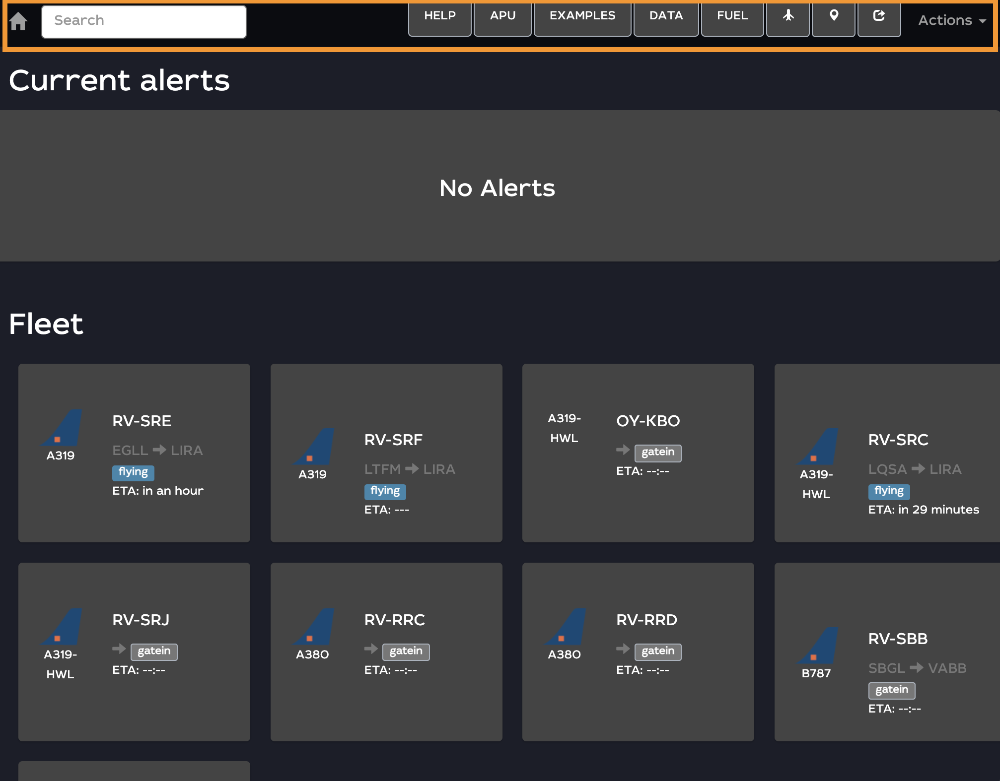

# header display


_NOTE: the header display will be visible at any moment of your navigation through the portal._ 


<figure><figcaption>
header display
</figcaption></figure>

Header Display has got plenty of functions; from the left to right:

* _home button:_ gets you back to main/home page
* _search box:_ let’s you search by aircraft registration (and some other features)
* _customised bookmarks_:  they can be created on request
* _Actions:_ basic actions list gets you to [_logout_](../welcome-page/logout.md) and [_open a ticket_](../open-a-ticket.md).
