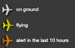

# map

Displays all the aircrafts from fleet (independently from the aircraft type) on the live world map.

<figure><figcaption></figcaption></figure>

On the top of the map, you can  find the [header](fleet-header.md).

On the top left corner of the map, you have the zoom in/zoom out buttons. You can also just use the scroll in/out on your mouse.&#x20;

#### Aircraft ICONs

The aircraft icons are displayed all over the map, depending on its latest received position. Each aircraft is displayed in one  of 3 colours that describes it's situation:&#x20;

<figure><figcaption>
aircraft  information
</figcaption></figure>

While moving over the aircraft icon, the tooltip will show up to give you more information:

* airport from/to (if flying)
* last ACARS message received
* last alert (if alert is set in the last 10 hours)

<figure><figcaption>
aircraft flying information
</figcaption></figure>

 

<figure><figcaption>
aircraft with an alert in the last 10 hours
</figcaption></figure>

#### Airport

Airports are shown as yellow dots on the world map. While moving over the airport icon, the tooltip will show up to give you more information:

* airport ICAO
* airport name

<figure><figcaption>
airport info
</figcaption></figure>

#### Aircraft route

The lime/grey lines are showing the aircraft route between the airports (shown as yellow dots). If the FROM/TO information is known - the aircraft route will connect both airports.&#x20;
